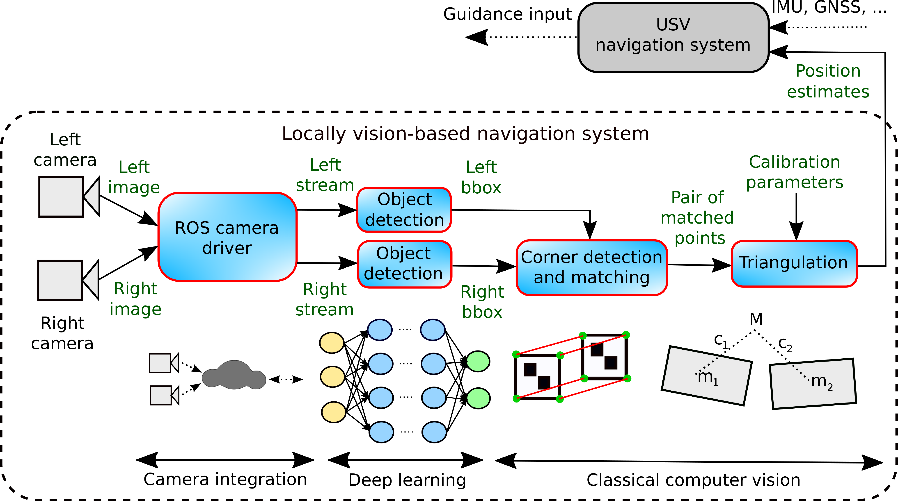

# Vision-Based Navigation in ROS

## Overview
This repo contains source code for vision-based navigation in ROS. We combine deep learning and traditional computer vision methods along with ArUco markers for relative positioning between the camera and the marker. Both monocular and stereo vision are used for comparison. It is tested with Ubuntu 18.04 LTS and ROS melodic on an Nvidia Jetson Xavier. The figure below shows the high-level architecture with focus on stereo vision. 

Please include the following reference when you use the toolbox:
Ø. Volden (2020)."Vision-Based Navigation in ROS". URL: https://github.com/oysteinvolden/vision-based-navigation

Bibtex entry:
@misc{VoldenVISIONROS2020,
  title = {Vision-{B}ased {N}avigation in {ROS}},
  author = {{{\O}}. Volden},
  howpublished = {\url{https://github.com/oysteinvolden/vision-based-navigation}},
  year = {2020}
}

## Installation

### Dependencies

**CUDA**

Cuda is preinstalled on Nvidia Jetson Xavier.

**ROS**

- If you use a standard PC with x86 architecture, follow the instructions here: http://wiki.ros.org/melodic/Installation/Ubuntu. Full-desktop version is recommended if disk-space is not critical.

- For arm-based Nvidia Jetson Xavier:

      git clone https://github.com/jetsonhacks/installROSXavier
      cd installROSXavier
      ./installROS.sh -p ros-melodic-desktop-full
      
This repo also provide a quick solution to setup a catkin workspace by running the command:

      ./setupCatkinWorkspace.sh
	

**OpenCV**

- For standard laptops, installation instructions from here is recommended: https://www.pyimagesearch.com/2018/05/28/ubuntu-18-04-how-to-install-opencv/.

- For Jetson Xavier:

      git clone https://github.com/AastaNV/JEP
      cd script
      ./install_opencv4.1.1_Jetson.sh
 

### Install and configure vision-based navigation pipeline

The darknet_ros package is used for the left camera, while the darknet_ros_2 package is used for the right camera.

1. First clone the repo get access to both.

	   git clone --recursive https://github.com/oysteinvolden/vision-based-navigation.git
	
2. Create a catkin workspace.

       mkdir -p darknet_ws/src
       cd darknet_ws/src

3. copy recursively the darknet_ros, darknet_ros_msgs and darknet folders from the cloned repository to the catkin environment (/darknet_ws/src) and include ROS package for bridging opencv and ROS (vision_opencv).

       git clone https://github.com/ros-perception/vision_opencv.git 
       cd ..
       catkin_make -DCMAKE_BUILD_TYPE=Release
    
Repeat 2-3 for a second catkin workspace (e.g. /darknet_ws2) suitable for the right camera. Remember to copy recursively the darknet_ros_2 folder to the catkin environment (/darknet_ws2/src) instead of the darknet_ros folder. 

 

**Configuration**

It is assumed that the trained weights and configuration (cfg) file is available for YoloV3 (darknet). 

- darknet folder:
	- Adjust Makefile such that GPU, Opencv, CuDNN, CuDNN_HALF and OpenMP is enabled (uncommented)
	- Also enable jetson Xavier Arch and disable all others (in Makefile). Then make locally in the darknet folder. 

- darknet_ros folder:
	- in yolo_network_config:
		- put trained weights and cfg file (under subfolders weights and cfg, respectively)
	- in darknet_ros/config:
		- yolov3-spp.yaml: Ensure the content match what is used in the yolo_network_config
		- ros.yaml: The topic under "camera_reading" should match the ros topic name sent from the camera driver, e.g. /camera_array/cam0/image_raw or /camera_array/cam1/image_raw. Just use one camera topic name per ROS node for subscription
	- in darknet_ros/launch:
		- darknet_ros.launch and yolov3-spp.launch: Check that they include correct weights/cfg and yaml file (yolov3-spp.yaml)
	
NB! Calibration parameters and camera resolution is defined in the source code for specific purposes. Marker specific configuration is also specified in the source code. 

### Install and configure camera driver
We use a ROS compatible [camera driver](https://github.com/neufieldrobotics/spinnaker_sdk_camera_driver). By this, the camera driver and the object detection pipeline can interchange data via ROS topics. Follow the instructions in this github repository to create a catkin workspace. We use hardware triggering (GPIO connector) for stereo setup as described under "Multicamera Master-Slave Setup" in the [github repo](https://github.com/neufieldrobotics/spinnaker_sdk_camera_driver). When GPIO cables are connected correctly, do the following:

- In params:
	- stereo_camera_example.yaml: Change camera ids to serial numbers of the actual cameras. Make sure left camera is master camera (primary).
- in launch:
	- acquisition.launch: change from test_params.yaml to stereo_camera_example.yaml (line 22). 

	

### Install LiDAR driver
We use a ROS compatible [LiDAR driver](https://github.com/ouster-lidar/ouster_example/tree/master/ouster_ros) for verification of camera measurements, i.e. not a part of the core functionality. Follow the instructions in the github repository to interface and create a catkin workspace. 

## Hardware

This section shows the specific hardware in use. 

  - 2 x Camera: [FLIR Blackfly S GigE (BFS-PGE-13Y3C-C)](https://www.edmundoptics.com/p/bfs-pge-13y3c-c-poe-gige-blackflyr-s-color-camera/40198/).
  - 2 x Lens: [Edmund Optics](https://www.edmundoptics.com/p/35mm-fl-wide-angle-low-distortion-lens/23288/). 
  - GPIO connector: [Hirose HR10](https://www.flir.co.uk/products/hirose-hr10-6-pin-circular-connector/).
  - Lidar: [Ouster Os1](https://ouster.com/products/os1-lidar-sensor/).
  - PC: [Nvidia Jetson Xavier](https://developer.nvidia.com/embedded/jetson-agx-xavier-developer-kit).
  - DC/DC converters.
  - PoE adapters.
  - Switch / ethernet cables. 
  
  The figure below shows the power and ethernet interface between the hardware components and the guidance, navigation, and conrol (GNC)computer for the USV.
  
  
  
  
## Dataset

Datasets, model parameters and test scenarios can be found in the following link:
https://drive.google.com/drive/u/0/folders/1jc0gy81dSRRfRxAGuXiN1P2s_waCPXsG

## Basic usage

### Launch camera driver
To launch the driver, open a terminal and type:

    cd ~/spinnaker_ws
    source devel/setup.bash
    roslaunch spinnaker_sdk_camera_driver acquisition.launch

### Launch LiDAR driver
To launch the driver, open a terminal and type:

    cd ~/myworkspace
    source devel/setup.bash
    roslaunch ouster_ros os1.launch os1_hostname:=os1-991837000010.local lidar_mode:=2048x10 os1_udp_dest:=192.168.11.219
 
- <os1_hostname> can be the hostname (os1-991xxxxxxxxx) or IP of the OS1 (serial number)
- <lidar_mode> is one of 512x10, 512x20, 1024x10, 1024x20, or 2048x10 (optical resolution)
- <udp_data_dest_ip> is the IP to which the sensor should send data (make sure it is on the 192.168.x.x subnet)

### Launch vision-based navigation pipeline
Open a terminal and type the following:

	cd ~/darknet_ws
	source devel/setup.bash
	roslaunch darknet_ros yolov3-spp.launch
	
Go into a second terminal and type the following:
	
	cd ~/darknet_ws2
	source devel/setup.bash
	roslaunch darknet_ros yolov3-spp.launch
	
Hence, you have one ROS node per camera and they run simultaneously. 
	

### ROS topics

**Images**

* **`/camera_array/cam0/image_raw`** ([sensor_msgs/Image])
* **`/camera_array/cam1/image_raw`** ([sensor_msgs/Image])

Original image data from a pair of FLIR blackfly S cameras. 
 
  
**Point cloud**

* **`/os1_cloud_node/points`** ([sensor_msgs/Pointcloud2])

    Original point cloud data from an Ouster Os1 lidar. 

**Author: [Oystein Volden](https://www.ntnu.no/ansatte/oystv), oystein.volden@ntnu.no**

**Credit: The pipeline is further extended and developed for 3D localization tasks based on relevant object detection frameworks such as [YOLO ROS: Real-Time Object Detection for ROS](https://github.com/leggedrobotics/darknet_ros) by Marko Bjelonic and [YOLO ROS: Real-Time Object Detection for ROS](https://github.com/pushkalkatara/darknet_ros) by Pushkal Katara.**

